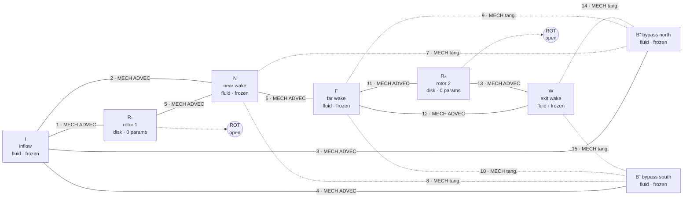

# Wind-Farm Agent Graph — Figure

**Type:** Core Concept — Figure (folder: `Atlas 0.1/case-study-wind-farm-wake/`)
**Rendered version:** [`wind-farm-agent-graph.html`](wind-farm-agent-graph.html) in this folder — a to-scale plan view, the abstract port graph, and the full edge schedule. Published at <https://claude.ai/code/artifact/aee2281f-1043-411e-9888-5655e7dabd3f>.
**Related Concepts:** [[spec-wind-farm-wake-atlas-0.1]], [[case-study-wind-farm-wake-2d-atlas-0.1]], [[impl-wind-farm-guide]], [[port-algebra-atlas-0.1]]

> **This figure earned its keep before it was finished.** Drawing the partition to scale exposed that the rotor strips and the bypass corridors both **overlapped their neighbours**, and that the bypass domain in the agent table contradicted the interface curve in the edge table. Both are fixed in [[spec-wind-farm-wake-atlas-0.1]] §3. Left in place they would have fired the scaffold's import-time assertion that every interface curve lies on *both* agents' boundaries — the same class of error the rocket hit at $d\!-\!g$ ([[atlas-0.1-implementation-log]], 2026-08-09).

---

# 1. Plan view (schematic)

Flow left → right. Domain $[-6,18]\times[-4,4]$ in rotor diameters. Rotors at $x=0$ and $x=7$.

```
          y
        +4 ┌───────────────────┬──────────────────────────────────────────────┐
           │                   │                    B⁺  bypass north          │
        +2 │                   ├──7──────┬──9───────┬──────────14─────────────┤
           │                   │    N    │     F    │            W            │
      +0.5 │         I         ├─1─▓R₁▓─5┤ far wake ├11─▓R₂▓─13               │
         0 │      inflow       │  near   │          │  ▓  ▓                   │
      −0.5 │                   ├─2───────┤    ←6→   ├12───────────────────────┤
        −2 │                   ├──8──────┴──10──────┴──────────15─────────────┤
           │                   │                    B⁻  bypass south          │
        −4 └───────────────────┴──────────────────────────────────────────────┘
            −6                 0    3         7                            18   x
                               ↑                ↑
                          rotor 1 (R₁)     rotor 2 (R₂)
                          ROT port open    ROT port open
```

Edges **3** and **4** run vertically at $x=0$ in the bypass bands (top and bottom), joining $I$ to $B^+$ and $B^-$.

**Reading notes.**

- **Upstream of rotor 1 the full height is one agent.** There is no wake yet to separate from a bypass, so the wake/bypass split begins at $x=0$ — not at the domain inlet.
- **$N$ and $W$ are rectangles with a notch** where the rotor strip sits. Handled by the same active-mask channel the Phase-1 scaffold already built for the rocket's agents $b$ and $e$.
- **The rotor strips are $0.1D$ thick** — 0.4% of the domain length. Any drawing exaggerates them.

---

# 2. Port graph



## 2.1 What the topology says

- **The graph has cycles.** $I\to N\to F\to W$ and $I\to B^\pm\to\ (\text{shear edges})\to W$ are two distinct paths between the same agents, so **message passing is path-dependent**. The rocket's near-chain graph never tested this. Agent-graph diameter is 4 ($I\to R_1\to N\to F\to R_2$), so the scaffold's $n_{\text{mp}}=4$ carries over unchanged.
- **The bypass is load-bearing.** Delete $B^\pm$ and the wake agents have no momentum source, so the deficit becomes permanent and the model is visibly wrong. This is the partition's most important choice and its most legible failure mode.
- **The disks are the only heterogeneous nodes.** Every solid edge touching $R_1$ or $R_2$ is a closed-form expert meeting a learned one — the coupling this case study exists to test, and the only place the flux residual is *enforceable* rather than merely measurable.
- **Two ports lead nowhere on purpose.** $R_1$ and $R_2$ each expose a `ROT` shaft port with nothing attached; the extracted power leaves the model through them and appears in $P_{\text{ext}}$ of the global power residual. Rung 7 of [[f1-pathmap-and-end-goal]] *connects* those ports rather than integrating a subsystem.

---

# 3. Agent schedule

| ID | Agent | Domain | Expert | Tokens |
|---|---|---|---|---|
| $I$ | inflow corridor | $x\in[-6,0)$, $\lvert y\rvert\le4$ | `fluid` frozen | 192 |
| $R_1$ | rotor 1 | $x\in[0,0.1]$, $\lvert y\rvert\le0.5$ | `disk` closed form | 20 |
| $N$ | near wake | $x\in[0,3]$, $\lvert y\rvert\le2$ minus $R_1$ | `fluid` frozen | 192 |
| $F$ | far wake | $x\in(3,7)$, $\lvert y\rvert\le2$ | `fluid` frozen | 256 |
| $R_2$ | rotor 2 | $x\in[7,7.1]$, $\lvert y\rvert\le0.5$ | `disk` closed form | 20 |
| $W$ | exit wake | $x\in[7,18]$, $\lvert y\rvert\le2$ minus $R_2$ | `fluid` frozen | 176 |
| $B^+$ | bypass north | $x\in[0,18]$, $2<y\le4$ | `fluid` frozen | 144 |
| $B^-$ | bypass south | $x\in[0,18]$, $-4\le y<-2$ | `fluid` frozen | 144 |

**Total ≈ 1,144 tokens**, matched deliberately to the 1,114 the Phase-1 scaffold already runs at.

# 4. Edge schedule

| # | Edge | Interface curve | Ports | Residual |
|---|---|---|---|---|
| 1 | $I\!-\!R_1$ | $x=0$, $\lvert y\rvert\le0.5$ | `MECH`, `ADVEC` | **enforced** |
| 2 | $I\!-\!N$ | $x=0$, $0.5<\lvert y\rvert\le2$ | `MECH`, `ADVEC` | measured |
| 3 | $I\!-\!B^+$ | $x=0$, $2<y\le4$ | `MECH`, `ADVEC` | measured |
| 4 | $I\!-\!B^-$ | $x=0$, $-4\le y<-2$ | `MECH`, `ADVEC` | measured |
| 5 | $R_1\!-\!N$ | $x=0.1$, $\lvert y\rvert\le0.5$ | `MECH`, `ADVEC` | **enforced** |
| 6 | $N\!-\!F$ | $x=3$, $\lvert y\rvert\le2$ | `MECH`, `ADVEC` | measured |
| 7 | $N\!-\!B^+$ | $y=+2$, $0<x\le3$ | `MECH` tang. | measured |
| 8 | $N\!-\!B^-$ | $y=-2$, $0<x\le3$ | `MECH` tang. | measured |
| 9 | $F\!-\!B^+$ | $y=+2$, $3<x<7$ | `MECH` tang. | measured |
| 10 | $F\!-\!B^-$ | $y=-2$, $3<x<7$ | `MECH` tang. | measured |
| 11 | $F\!-\!R_2$ | $x=7$, $\lvert y\rvert\le0.5$ | `MECH`, `ADVEC` | **enforced** |
| 12 | $F\!-\!W$ | $x=7$, $0.5<\lvert y\rvert\le2$ | `MECH`, `ADVEC` | measured |
| 13 | $R_2\!-\!W$ | $x=7.1$, $\lvert y\rvert\le0.5$ | `MECH`, `ADVEC` | **enforced** |
| 14 | $W\!-\!B^+$ | $y=+2$, $7<x\le18$ | `MECH` tang. | measured |
| 15 | $W\!-\!B^-$ | $y=-2$, $7<x\le18$ | `MECH` tang. | measured |
| — | $R_1$, $R_2$ shafts | lumped | `ROT` | **unconnected** |

**Enforcement is structural, not editorial.** The four enforced edges are disk faces, where one side is closed-form and the residual is therefore projectable to zero. The other eleven have a frozen learned expert on both sides — nothing to project onto, nothing to train against — so their residual is *measured and reported*, never claimed as conserved. See [[conservation-as-constraint-atlas-0.1]]'s enforce-or-measure rule.

---

## See Also

- [[spec-wind-farm-wake-atlas-0.1]] — the binding spec these tables are drawn from
- [[impl-wind-farm-guide]] — the phased build guide
- [[port-algebra-atlas-0.1]] — what `MECH`, `ADVEC` and `ROT` mean
- [[case-study-wind-farm-wake-2d-atlas-0.1]] — why this scenario
