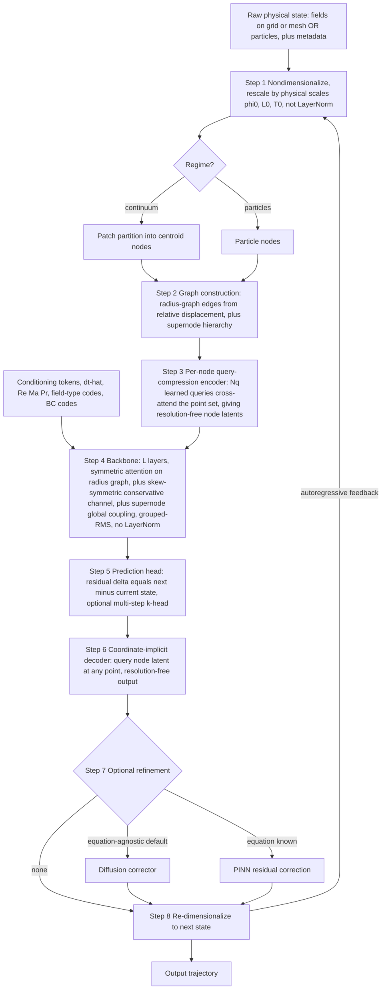

# Initial PFM Model — Full Architecture & Workflow

**Type:** Concept — initial model master page (folder: Noether 1.0)
**Status:** End-to-end assembly of all committed components, with the gaps filled. Implementation-oriented.
**Related Concepts:** [[00-initial-model-overview]], [[graph-tokenizer]], [[normalization-scheme]], [[symmetric-attention-physics]], [[index-share-sparse-attention]], [[hierarchical-query-attention]], [[pfm-interface-design]]
**Related Summaries:** [[gphyt-physics-foundation-model]], [[walrus-paper]], [[poseidon-pde-foundation-model]], [[dynami-cal-graphnet]], [[glm-index-share-attention]]

---

## One-sentence summary

A **graph-tokenized, symmetric-attention transformer** that ingests any nondimensionalized physical state (continuum fields *or* particles) as a resolution-free node graph, evolves it with reciprocal + conservative attention to predict the next state directly, and optionally refines the output with an equation-agnostic diffusion corrector — built for multiphysics breadth with conservation and long-horizon stability wired into the architecture.

---

## The pipeline



ASCII fallback of the same flow:

```
raw state ─► nondimensionalize ─► graph build (nodes + TYPED edges + supernodes)
   ─► dual-path node encoder (smooth latent + hi-freq residual) ─► [+conditioning] ─► backbone (L× symmetric+skew attention)
   ─► residual next-state head (+MTP) ─► CONSERVATION PROJECTION (S1.1, on final latent, after gain)
   ─► coordinate-implicit decoder ─► [chaotic: physics-guided diffusion GENERATES sub-grid residual ─► re-project]
   ─► re-dimensionalize ─► x_{t+1}
   └──────────────────────────── autoregressive feedback ───────────────────────────┘
```

---

## Stage-by-stage specification

### 1. Nondimensionalization ([[normalization-scheme]], [[pfm-interface-design]])
Rescale by characteristic scales $\phi_0, L_0, T_0$ so the model sees $O(1)$ dimensionless fields. Dimensionless numbers $(\mathrm{Re},\mathrm{Ma},\mathrm{Pr},\dots)$ become conditioning. This is the physically-correct dynamic-range handler that replaces most of LayerNorm's role.

### 2–3. Graph tokenization ([[graph-tokenizer]])
- **Nodes:** one per particle (kinematic state) or one per field patch (centroid, with a latent of the patch interior). Both produce the same kind of node latent — the **continuum–particle bridge**.
- **Edges:** radius graph, built from **relative displacement** $x_j-x_i$ → translation-invariant; antisymmetric edge frames seed Newton's-3rd-law momentum conservation ([[dynami-cal-graphnet]]). **Typed-edge encoder (S4.1):** per-node-type embeddings $\tau_i$ let heterogeneous (field↔particle) nodes exchange a momentum-consistent message through one shared protocol — the coupled-systems bridge.
- **Supernode hierarchy:** coarse summary nodes for $O(N)$ global/elliptic coupling ([[multipole-graph-neural-operator]]); reused as Index Share landmarks and HierarQ scene queries. **The coarsest supernode carries the global conserved totals** that Stage 5b's projection reads (S1.1).
- **Node encoder (dual-path, S3.1):** $N_q$ learned queries cross-attend over the node's point set → **resolution-free** smooth latent ([[learned-query-compression-tokens]], [[hierarchical-query-attention]]), **plus an explicit high-frequency residual channel** ([[wave-particle-dual-tokens]]) that preserves sub-patch sharp features and is the band the Stage-7 diffusion generates into.

### 4. Backbone ([[symmetric-attention-physics]], [[00-attention-overview]])
$L$ layers, each:
$$h_i^{\ell+1} = h_i^\ell + \epsilon\,\sigma\!\Big[(W-W^\top-\gamma I)h_i^\ell + \sum_{j\in\mathcal N(i)} A_{ij}(V_j^\ell-V_i^\ell)\Big],\quad A_{ij}=\tanh\!\big(\tfrac{\langle q_i,k_j\rangle+\langle q_j,k_i\rangle}{2\sqrt{d_k}}\big)=A_{ji}.$$
- **Reciprocal interaction** (force-style aggregation) → conserves aggregate momentum.
- **Skew-symmetric channel** → conserves energy/information, non-dissipative depth ($\gamma$ tunes physical dissipation).
- **Local** via radius graph; **global** via supernode/landmark edges.
- **Large contexts:** [[index-share-sparse-attention]] (sparse, symmetric neighborhoods) and/or [[hierarchical-query-attention]] (compressed token budget). **Deferred for the initial model** — the radius-graph tokenizer already gives locality-sparsity for free, and the smoke-test problems have small token counts where dense symmetric attention over the graph is cheaper and strictly better (see "Do we need sparse attention?" below).
- **No LayerNorm** inside the block; grouped-RMS / equivariant gain only where calibration is needed ([[normalization-scheme]]).
- **Per-node nonlinear (FFN) sub-step — [[open-architectural-problems]] Problem 12, adopted F1.** A second Euler sub-step per layer, after the attention sub-step above, restores per-node feature-mixing capacity that pure attention lacks:
$$h_i^{\ell+1} \mathrel{+{=}} \epsilon\,\big(W_2\,\phi(W_1 h_i^{\ell+1})\big),\qquad W_1^\top W_1=I,\ W_2W_2^\top=I,$$
a **norm-bounded** (semi-orthogonal expand→contract) FFN — full hidden-width nonlinear capacity without unbounded amplitude drift, so it stays compatible with the skew-symmetric channel's norm story and the Stage-5b projection. Guards against attention-only rank collapse and gives the local nonlinear capacity multiphysics constitutive relations need. The **F3 no-FFN baseline is a mandatory ablation**, not a fallback default.

### 5. Prediction head — direct state, residual-parameterized
Predict the **residual** $\hat\Delta_i = \hat x_{t+1}-\hat x_t$ per node (smoother target, better rollout) — still direct next-state, **no classical integrator**. Optionally a **multi-token head** predicts $k$ steps at once (GLM MTP, [[glm-index-share-attention]]) with an inter-step smoothness/consistency penalty, a learned integrator-free analog of multi-step time-stepping that pressures the model toward long-horizon coherence.

### 5b. Conservation projection — mandatory (S1.1)
The predicted state is projected onto the conserved manifold **before decode**, converting depth-conservation into *time*-conservation (the fix for Problem 1):
- A **trained conserved-readout** $\hat C(h)=W_C h$ estimates the global integrals (mass, momentum, energy) from the *final* latent $h^L$ — validated to match the physical integral read at the coarsest supernode. (Project **once, on the final latent**, not between blocks: per-block projection would harden the irrelevant *depth*-conservation and over-constrain intermediate computation.)
- Project onto $\{h : \hat C(h) = C_{\text{target}}\}$ with $C_{\text{target}} = C_t + (\text{boundary flux})$. Linear invariants (mass, momentum) → closed-form rank-$k$ correction; energy (quadratic) → min-norm rescaling.
- **Placement:** the projection is the **last magnitude-affecting operation** — *after* any output RMS/gain (which rescales magnitude = energy and would otherwise undo it, [[normalization-scheme]]) and, when diffusion runs, *after* Stage-7 residual generation (order: project → diffuse-residual → re-project).
- **Tiered invariants (folds in S1.3):** *known* universal invariants are enforced with exact analytic forms; *system-specific/hidden* invariants (enstrophy, helicity, integrable charges) are **discovered** as minimum-variance, non-degenerate latent probes across the rollout, enforced softly, and **promoted to hard projection only after validation**. So the model helps pick the invariants — tiered, not either/or.
- **Global scalars vs. local/elliptic constraints (splits with Problem 2).** Global-scalar conservation (mass, momentum, energy) projects cleanly *in latent space* via the readout above. But **divergence-free and boundary conditions are local/elliptic** — they have no clean latent form and must be projected *in physical space, post-decode*, as one **joint** solve (Problem 2, P2.2): stack conservation + Dirichlet-BC + divergence rows into a single $Ax=b$ and project onto their intersection, with the elliptic part run as a Poisson/Leray V-cycle on the supernode hierarchy (P2.1). Refined pipeline order: *latent global-scalar projection → decode → physical-space joint div-free + BC projection → diffuse residual → re-project*.

### 6. Decoder ([[coordinate-implicit-tokens]])
Coordinate-conditioned implicit decoder: query each node latent at any continuous $y$ in its patch → reconstruct the field at arbitrary resolution. For particles, decode to the updated kinematic state.

### 7. Refinement / generative core — LES scale split (S5.1)
Scales are split LES-style: the backbone regresses the **resolved** scales; a **physics-guided latent diffusion** model *generates* the **chaotic sub-grid** detail on the S3.1 high-frequency residual channel.
- **Diffusion (generative core for chaos, equation-agnostic)** — generates/denoises the sub-grid residual in latent space, **constraint-projected** (guided / DPS) so the generated detail stays divergence-free/conservative ([[arch-diffusion-backbone]], [[pisd-physics-informed-spectral-diffusion]]); yields ensemble uncertainty. For turbulent regimes this is **load-bearing, not optional** — a deterministic head blurs to the conditional mean. For smooth/laminar regimes it reduces to optional cleanup.
- **PINN residual correction** (when the equation is known) — a few steps minimizing the PDE residual ([[physicsformer-pinn-ns]]).
Confined to the residual channel so it cannot perturb the conserved aggregate; evaluated with **spectral/statistical** metrics, not pointwise MSE. **Routing (S5.2, adopted):** an in-context regime classifier — reading trajectory statistics, the same mechanism that infers $\mathrm{Re}$ — routes smooth/laminar states to the deterministic core and chaotic/turbulent states to the generative core, so diffusion cost is paid only where determinism fails. *Still to spec:* the guided-diffusion constraint-projection mechanism (how generated detail is made div-free/conservative), which now shares the Problem-2 projection machinery.

### 8. Re-dimensionalize & roll out
Restore physical units; feed the output back as context for autoregressive rollout (initially ground-truth context, then predicted — push-forward training mitigates the train/inference gap).

---

## The inbuilt conservation / stability mechanism (the headline goal)

Stability is **architectural**, layered across the pipeline rather than added as a loss:

| Mechanism | Conserves / stabilizes | Stage |
|---|---|---|
| Antisymmetric edge frames | linear & angular momentum (Newton's 3rd) | tokenizer |
| Force-style reciprocal aggregation | aggregate momentum | backbone |
| Skew-symmetric linear channel | energy / information; non-dissipative depth | backbone |
| Tunable $\gamma$ | matches true physical dissipation | backbone |
| Residual + MTP prediction | smooth targets; horizon coherence | head |
| **projection onto conserved totals (S1.1)** | **hard conservation; depth→time** | **head — mandatory** |
| push-forward / multi-step training | rollout robustness | training — retained *complement* |

The first five are architectural and always on; **the projection head is now also mandatory (S1.1)** — depth-conservation alone does not give trajectory conservation, so the projection is on the critical path, not an ablation. Push-forward/multi-step training is retained as a complement, not a substitute. **[AI Inference]:** the projection stage is also the natural host for Problem 2's divergence-free / boundary-condition constraints — one projection, several constraints — so the S1.1 decision pulls Problem 2 toward the same mechanism.

---

## The non-text interface ([[pfm-interface-design]])
Five physical inputs, no text: (1) field/context trajectory (the node graph over $n$ recent steps), (2) $\widehat{\Delta t}$ token, (3) field-type codes, (4) dimensionless parameters, (5) boundary-condition spec.

### How physical quantities (Reynolds, Mach, …) enter the model

These are **not** raw input channels and **not** baked-in hyperparameters — they are **conditioning signals**. The path:

1. **They are produced by nondimensionalization (Stage 1).** Choosing characteristic scales $L_0, U_0, T_0, \phi_0$ collapses the dimensional governing equations into a handful of dimensionless groups — $\mathrm{Re}=U_0 L_0/\nu$, $\mathrm{Ma}=U_0/c_s$, $\mathrm{Pr}=\nu/\alpha$, etc. So the same step that makes the fields $O(1)$ also *generates* the parameter set that characterizes the regime.

2. **They are embedded on a log scale.** Each spans many orders of magnitude (laminar $\mathrm{Re}\sim10^2$ to turbulent $\sim10^6$), so embed $\log$ of the parameter through a small MLP (or sinusoidal) encoder, exactly as $\widehat{\Delta t}$ is handled:
$$z_{\text{param}} = \mathrm{MLP}\big([\log\mathrm{Re},\ \log\mathrm{Ma},\ \mathrm{Pr},\ \dots]\big).$$

3. **They are injected in three complementary places**, none of which adds a spurious cross-channel mean ([[normalization-scheme]]):
   - **Additive conditioning tokens** — $z_{\text{param}}$ (and $z_{\Delta t}$) are added to every node latent, like a global "regime" positional encoding: $\tilde h_i = h_i + z_{\text{param}} + z_{\Delta t}$.
   - **AdaLN-style conditional gain** — the structure-preserving gain in the backbone is a function of $z_{\text{param}}$ (scale only, never a mean shift), generalizing Poseidon's lead-time-conditioned norm ([[poseidon-pde-foundation-model]]).
   - **Query conditioning** — the encoder's learned queries are conditioned on $z_{\text{param}}$, so the *same* field is tokenized differently in different regimes ([[hierarchical-query-attention]], [[physics-conditioned-query-tokens]]).

4. **They can be left unknown and inferred in-context.** If a parameter is not supplied, pass a learned "unknown" mask token in its slot; the model infers the regime from the trajectory statistics (a turbulent trajectory implies high $\mathrm{Re}$), the most powerful form of physics in-context learning ([[pfm-interface-design]], [[in-context-learning-physics]]). The inferred value is linearly probeable in the latent space.

**Field-type codes** (which channel is velocity vs. pressure vs. $B$-field) and **boundary-condition codes** enter the same way — as discrete-embedded conditioning on nodes/edges — telling the model which transformation laws and constraints apply per channel.

### Do we need sparse attention?
**Not for the initial model.** Two reasons: (1) the graph tokenizer's **radius graph already is the sparsity** — each node only attends to neighbors, so locality-sparsity is built into the representation rather than bolted onto a dense attention matrix; (2) the smoke-test problems (1D Burgers, small 2D NS at $\sim$1M–10M params) have small token counts where **dense symmetric attention over the graph is cheaper and strictly better** than the routing overhead of [[index-share-sparse-attention]]. Explicit sparse attention becomes relevant only at large 2D/3D resolution or long trajectories — and even then it largely *coincides with* extending the graph's neighbor structure (local windows = radius edges, landmarks = supernodes). Treat it as a **scaling option layered on later**, not a Stage-1 commitment.

---

## Training plan

0. **Tokenizer fidelity gate (S3.4)** — pretrain the dual-path tokenizer autoencoder-style *before any dynamics*; require encode→decode error below the data's own discretization error on held-out turbulent/shock data. Go/no-go gate on latent adequacy (Problem 3).
1. **Pretraining corpus** — diverse multiphysics simulation data (The Well; Genesis-generated trajectories, [[genesis-physics-engine]]); broad from the start.
2. **Data amplification** — all2all / semi-group pairing turns $K$ snapshots into $O(K^2)$ training pairs ([[poseidon-pde-foundation-model]]); architecture-agnostic.
3. **Objective (Problem 6, resolved — full spec in [[training-curriculum]])** — four dependency-ordered loss groups: (A) core state fit — residual regression + spectral/statistical loss, per-channel uncertainty-weighted; (B) temporal consistency — MTP multi-step + push-forward curriculum; (C) conservation discovery — SFA-style soft penalty for **tier-2** (hidden) invariants only, since tier-1 known invariants are enforced architecturally by the S1.1 projection, not a loss; (D) generative — diffusion-denoising loss for the S5.1 core, trained in a separate phase on the (lightly fine-tuned) latent. Reconstruction loss (S3.4) is a separate G0 pretraining-stage objective, out of scope here.
4. **Rollout robustness (S1.5 adopted)** — push-forward training + context-noise injection with a **defined curriculum horizon schedule** ($1\to2\to4\to8$ steps), the trained-stability complement to the hard projection ([[gns-graph-network-simulators]], [[walrus-paper]]).
5. **Smoke test → coupled benchmark** — validate the full pipeline on one system (2D incompressible NS or 1D Burgers, [[possible-architectures]]) at 1M–10M params; **then a concrete coupled benchmark (S4.4: settling particles in a fluid)** to exercise the typed-edge coupling — before scaling to multiphysics.

---

## Planned ablations (resolve the open forks with evidence)

1. **Symmetric-only vs. symmetric + skew-symmetric** — predict: symmetric-only over-damps energy on Euler/wave (it is diffusion; [[symmetric-attention-physics]]). Load-bearing test of the conservative channel.
2. **Structure-preserving norm vs. standard LayerNorm** — predict: LayerNorm degrades energy-conservation & long-horizon metrics specifically ([[normalization-scheme]]).
3. **Direct-state vs. derivative prediction** — quantify the cost of dropping the classical integrator.
4. **Projection head on/off; MTP horizon $k$; refinement mode** — the deferred choices.
5. **Graph tokenizer vs. patch baseline** — does the continuum–particle representation pay for its complexity at equal compute?

---

## Risks & open problems

- **Graph-construction & irregular-memory cost** at scale ([[graph-mesh-tokens]]).
- **Multi-head antisymmetry** preservation through $W_O$ ([[symmetric-attention-physics]]).
- **Encoder query budget** $N_q$ vs. fine-scale loss — mitigated by the S3.1 dual path, but with no committed fidelity floor (S3.4).
- **Mixed continuum–particle graphs** — S4.1 gives the typed-edge slot; the *physically meaningful* cross-type message (scale/unit mismatch) remains unsolved.
- **Projection well-posedness (S1.1)** — quadratic energy projection is non-unique; conserved-readout fidelity must be validated; boundary-flux targets needed for open systems.
- **Dual-path × diffusion coupling (S3.1 × S5.1)** — the residual channel is deterministically *encoded* but stochastically *predicted*; the project-vs-diffuse ordering is load-bearing.
- **Refinement coupling** — the diffusion is confined to the residual channel and the state is re-projected after it, so it cannot perturb the conserved aggregate.
- **FFN norm-boundedness (Problem 12)** — the semi-orthogonal expand/contract sub-step bounds but does not exactly preserve amplitude through the nonlinearity; the Stage 5b/10 projection is still the authoritative conservation fix, not the FFN.
- See the **second-pass audit** in [[open-architectural-problems]] for the full post-decision hole list (Problem 4's cross-type message, Problems 7–10 remain; new interface holes).

---

## [AI Inference]

**[AI Inference]:** This architecture is a single consistent bet: *put the physics in the representation and the interaction geometry, not in the loss.* The tokenizer makes states into structure-preserving graph nodes; symmetric/skew-symmetric attention makes the dynamics reciprocal and conservative; nondimensionalization + structure-preserving norm keep scale/energy intact. If the bet is right, conservation and long-horizon stability are emergent properties of the architecture at any scale — which is exactly the property that would let "accuracy comes with scale" hold for physics the way it does for language.

**[AI Inference]:** The continuum–particle bridge and long-horizon stability — the two headline goals — are not independent. Both are downstream of the *same* decision to represent everything as a graph of neighborhood-latents evolved by conservative reciprocal interaction: the graph unifies particle and field (bridge), and the conservative interaction preserves invariants over rollout (stability). A single architectural commitment buys both goals, which is the strongest internal evidence that this is the right first model to build.

---

## See Also

- [[00-initial-model-overview]] — design commitments & rationale
- [[graph-tokenizer]] — stages 2–3 and 6
- [[symmetric-attention-physics]] / [[00-attention-overview]] — stage 4
- [[index-share-sparse-attention]] / [[hierarchical-query-attention]] — large-context scaling
- [[normalization-scheme]] — stage 1 + intra-backbone normalization
- [[pfm-interface-design]] — the non-text interface
- [[poseidon-pde-foundation-model]] — all2all training; conditional-norm precedent
- [[gphyt-physics-foundation-model]] / [[walrus-paper]] — direct-prediction & rollout-stability precedents
- [[possible-architectures]] — the smoke-test benchmark
- [[open-architectural-problems]] — the critical audit; Problem 12 (Stage 4's FFN sub-step) and Problem 6 (training plan §3)
- [[pipeline-contract]] — the binding forward-pass stage order and space split
- [[training-curriculum]] — the binding training-time loss/curriculum spec
