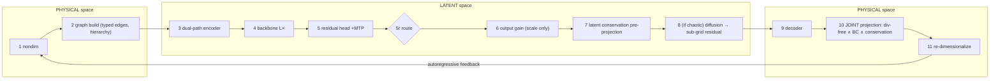

# The Pipeline Contract (initial model)

**Type:** Concept — initial model master spec (folder: Noether 1.0)
**Status:** The single source of truth for **stage order, per-stage interfaces, and the latent-vs-physical space split**. Written because — per the [[open-architectural-problems]] second-pass audit — after the S1.1/S3.1/S4.1/S5.1 + Problem-2 decisions, the project's risk moved *from components to interfaces*. This page pins the interfaces so the components compose correctly.
**Related Concepts:** [[initial-model-architecture]], [[graph-tokenizer]], [[normalization-scheme]], [[open-architectural-problems]], [[symmetric-attention-physics]], [[intelligent-patching]], [[multihead-attention]], [[pfm-interface-design]], [[training-curriculum]]
**Related Summaries:** [[gphyt-physics-foundation-model]], [[walrus-paper]], [[poseidon-pde-foundation-model]], [[dynami-cal-graphnet]], [[pisd-physics-informed-spectral-diffusion]]

---

## Why a contract (not just a diagram)

[[initial-model-architecture]] draws the flow; this page makes it *binding*. Three things a flow diagram leaves ambiguous but that are load-bearing here:

1. **Which space each stage acts in** — physical (real fields/units) vs. graph vs. latent. There are exactly two crossings: the **encoder** (physical→latent) and the **decoder** (latent→physical). Every hard constraint is defined in *one* of those spaces, and projecting in the wrong one is meaningless.
2. **The order of magnitude-affecting operations** — gain, conservation projection, diffusion, and constraint projection all touch amplitude, and amplitude *is* physics (energy). Their order is not free; a wrong order silently re-injects or removes energy.
3. **What each of the three tiers (enforce / regress / generate) hands to the others** — the global conserved totals, the resolved field, and the sub-grid detail live at different levels of the supernode hierarchy and must exchange specific messages.

The contract is: *if every stage honors its input/output type and the ordering invariants below, conservation, incompressibility, and boundary conditions hold at the output by construction.*

---

## Objects and notation

| Symbol                                                                          | Meaning                                                                 | Space                     |
| ------------------------------------------------------------------------------- | ----------------------------------------------------------------------- | ------------------------- |
| $x_t$                                                                           | raw physical state (fields on grid/mesh **or** particle states)         | physical (dimensional)    |
| $\hat x_t = x_t/\phi_0$                                                         | nondimensional state                                                    | physical (dimensionless)  |
| $z = (z_{\Delta t}, z_{\text{param}}, \text{field-type codes}, \text{BC spec})$ | conditioning                                                            | —                         |
| $G=(V,E,\mathcal H)$                                                            | graph: nodes $V$, **typed** edges $E$, supernode hierarchy $\mathcal H$ | graph                     |
| $h_i = (h_i^{\text{lo}}, h_i^{\text{hi}})$                                      | node latent: **smooth** path + **high-frequency residual** path (S3.1)  | latent                    |
| $C = (m, \mathbf p, E, \dots)$                                                  | global conserved totals, carried by the **coarsest supernode**          | latent readout / physical |
| $\hat\Delta_i = \hat x_{t+1}-\hat x_t$                                          | predicted residual (direct-state, no integrator)                        | latent                    |
| $\mathcal A x = b$                                                              | stacked linear constraints (conservation ∪ Dirichlet-BC ∪ divergence)   | physical                  |

**Three tiers** (mapped to hierarchy levels): **enforce** = top supernode (global invariants); **regress** = mid/fine nodes (resolved scales, the deterministic backbone); **generate** = residual channel $h^{\text{hi}}$ (sub-grid detail, the diffusion core).

---

## The stage sequence (binding order)

Pretrain-time gate (once, before any dynamics):

- **G0 — Tokenizer fidelity gate (S3.4).** Pretrain the dual-path tokenizer autoencoder-style; **require** encode→decode error below the data's discretization error on held-out turbulent/shock data. *Exit invariant:* the latent is provably adequate (Problem 3 closed) before dynamics training begins. If it fails, no downstream guarantee holds.

Per-step rollout (the contract proper):

| # | Stage | Space | In → Out | Exit invariant |
|---|---|---|---|---|
| 1 | **Nondimensionalize** ([[normalization-scheme]]) | physical | $x_t \to \hat x_t,\ z_{\text{param}}$ | $O(1)$ fields; regime encoded as conditioning |
| 2 | **Graph build** ([[graph-tokenizer]], [[intelligent-patching]]) | physical→graph | $\hat x_t \to G$ | nodes (particle/centroid), **typed** edges (S4.1), hierarchy $\mathcal H$, adaptive patches |
| 3 | **Dual-path encoder + conditioning** (S3.1) | graph→latent | $G,z \to \{h_i^{\text{lo}},h_i^{\text{hi}}\}$ | resolution-free latents; sharp features preserved in $h^{\text{hi}}$ |
| 4 | **Backbone** ([[symmetric-attention-physics]], [[multihead-attention]]) | latent | $h^0 \to h^L$ | depth-conservative update; no LayerNorm; norm-bounded FFN sub-step per layer ([[open-architectural-problems]] Problem 12, F1) |
| 5 | **Residual head (+MTP)** | latent | $h^L \to \hat\Delta$ | direct next-state residual |
| 5r | **Regime routing (S5.2)** | latent (reads context) | $\to \{\text{deterministic} \mid \text{generative}\}$ | which path §8 takes |
| 6 | **Output gain** (grouped-RMS/AdaLN, *scale only*) | latent | calibrate magnitude | equivariance & mean-structure intact |
| 7 | **Latent conservation pre-projection (S1.1)** | latent | project $h^L$ onto $\hat C = C_{\text{target}}$ | global scalars near-feasible (cheap, always on) |
| 8 | **[if generative] Latent diffusion → sub-grid residual (S5.1)** | latent | generate $h^{\text{hi}}$, constraint-guided | chaotic detail present; statistically correct |
| 9 | **Coordinate-implicit decoder** (SIREN/Fourier, non-spectrally-biased) | latent→physical | $h \to \hat u(y)$ | resolution-free field; high-$k$ emittable |
| 10 | **Physical-space joint constraint projection (P2.2)** | physical | $\hat u \to \hat u^\*$ | $\mathcal A\hat u^\*=b$: div-free ∧ BC ∧ conservation, **exactly** |
| 11 | **Re-dimensionalize** | physical | $\hat u^\* \to x_{t+1}$ | physical units restored |
| 12 | **Autoregressive feedback** | physical | $x_{t+1} \to$ context | push-forward curriculum (S1.5) |



ASCII fallback:

```
[PHYSICAL] 1 nondim ─► 2 graph build (typed edges + hierarchy + adaptive patches)
[LATENT]   ─► 3 dual-path encoder(+cond) ─► 4 backbone ─► 5 residual head(+MTP) ─► 5r route
           ─► 6 output gain(scale only) ─► 7 latent conservation pre-projection
           ─► 8 [if chaotic] diffusion generates sub-grid residual
[PHYSICAL] ─► 9 decoder ─► 10 JOINT projection {div-free ∧ BC ∧ conservation} ─► 11 re-dimensionalize ─► x_{t+1}
           └────────────────────── autoregressive feedback (push-forward) ──────────────────────┘
```

---

## The space map (the part a flow diagram hides)

There are **two authoritative constraint sites**, in **two different spaces**, and this split is the crux of the whole contract:

- **Latent (Stage 7) — global scalars only.** Total mass/momentum/energy are *global functionals*; they have a faithful **linear readout** $\hat C(h)=W_C h$ (validated at G0/against the top supernode), so they can be projected *in latent space, cheaply, without decoding*. This is a **pre-projection**: it keeps the state near-feasible so the authoritative projection (Stage 10) is a small correction.
- **Physical (Stage 10) — local & elliptic constraints.** Divergence-free ($\nabla\cdot u=0$) and boundary conditions are statements about the *actual field*; they have **no clean latent form** (the decoder is nonlinear, so the div-free subspace does not pull back to a latent subspace). They **must** be projected after decode, in physical space. Stage 10 also re-checks conservation, so it is the single authoritative guarantee.

**[AI Inference]:** The reason the split is unavoidable, not a convenience: a constraint can be projected in latent space *iff* it is a (near-)linear functional of the latent with a stable readout. Global integrals qualify; pointwise differential constraints ($\nabla\cdot u$ at every node) do not, because differentiation and the nonlinear decoder do not commute. So "which space?" is decided by *linearity-through-the-decoder*, and that test cleanly separates the two projection sites.

---

## The three-tier interfaces (what each tier hands the others)

The enforce/regress/generate tiers are levels of **one** supernode hierarchy $\mathcal H$; the hierarchy's restriction $R$ (fine→coarse) and prolongation $P$ (coarse→fine) operators *are* the inter-tier bus.

| Message | From → To | Carried by | Content |
|---|---|---|---|
| **global correction** | enforce → regress | prolongation $P$ | the conserved-total deficit, broadcast down and distributed onto fine nodes (Stage 7/10) |
| **resolved conditioning** | regress → generate | direct (residual channel) | the smooth decoded field conditions the diffusion (Stage 8) |
| **constraint spec** | enforce → generate | guidance term | div-free/conservation targets that *guide/project* the generated detail (Stage 8→10) |
| **detail feedback** | generate → enforce | restriction $R$ | generated detail changes local integrals, so Stage 10 re-reads $C$ and re-enforces |

This is the concrete form of the audit's ask ("specify the interface each tier exposes"). The **enforce tier owns the invariants**, the **regress tier owns the resolved dynamics**, the **generate tier owns the stochastic sub-grid** — and no tier may write another's quantity except through these four messages. In particular, the generate tier may *only* touch $h^{\text{hi}}$; it can never perturb the conserved aggregate directly (that is why diffusion is confined to the residual channel).

---

## Load-bearing ordering invariants (violate → silent failure)

These are the rules the contract exists to protect. Each has a concrete failure mode.

1. **Gain before conservation projection (6 → 7).** The gain rescales magnitude = energy; applied *after* the projection it would undo the enforced energy. → *Symptom: energy drifts despite the projection.*
2. **Conservation projection = last magnitude op in latent space.** Nothing may rescale amplitude after Stage 7 except the authoritative Stage 10. ([[normalization-scheme]] ordering constraint.)
3. **Constraint projection is physical & post-decode (after 9).** Div-free/BC cannot be enforced in latent space. → *Symptom: decoded field has $\nabla\cdot u\neq 0$ though "the model was told" incompressible.*
4. **Projection is JOINT, not sequential (Stage 10).** Conservation, BC, and divergence are coupled; projecting onto one *violates* the others. Solve $\mathcal A x=b$ onto the **intersection** in one KKT solve (or iterate, Dykstra). → *Symptom: whichever constraint is projected last is the only one satisfied.*
5. **Targets $b$ must be compatible.** E.g. net boundary flux $=$ rate of mass change (divergence theorem); else $\mathcal A x=b$ is infeasible and the Poisson solve is ill-posed. Check feasibility before solving.
6. **Diffusion generates, then Stage 10 re-projects (8 → 10).** Generated detail is not automatically admissible; the authoritative projection must run *after* generation. → *Symptom: pretty but unphysical small scales (hallucinated turbulence violating constraints).*
7. **Route before you generate (5r → 8).** The regime decision gates whether §8 runs at all; deciding after wastes the diffusion or misroutes. 
8. **G0 gate before dynamics.** No conservation/constraint guarantee means anything if the tokenizer silently discarded the content the constraints act on.

---

## The autoregressive contract

- **Feedback is physical.** Stage 11's re-dimensionalized $x_{t+1}$ re-enters at Stage 1; the loop is closed in physical space so every step begins from an admissible, dimensional state.
- **Deterministic-encode / stochastic-predict on the residual channel.** At *encode* (Stage 3) $h^{\text{hi}}$ is reconstructed deterministically from the input; at *predict* (Stage 8) it is *generated* as a sample. The contract requires that the fed-back state be a *single realized* field (Stage 10 output), so the next step encodes a concrete residual again — the stochasticity does not accumulate as a distribution over rollout, only as path-dependence. *(This is the S3.1×S5.1 tension flagged in the audit; the contract resolves it by re-realizing at Stage 10 each step.)*
- **Push-forward curriculum (S1.5).** Train the loop on horizons $1\to2\to4\to8$ with context-noise injection, so the model sees its own (projected) outputs as inputs.

---

## Regime specializations of the contract

The contract has three legal reductions (the pipeline is one graph; regimes prune stages):

- **Particle-only (N-body).** No field decode: Stage 9 maps latents to kinematic state; Stage 10 enforces momentum/energy (linear/quadratic, cheap) with **no elliptic solve** (no divergence constraint). Typed edges (S4.1) inactive unless coupled.
- **Incompressible fluid (the smoke test).** Full pipeline; Stage 10 is the joint Leray + no-slip solve on the hierarchy. This is the stressing case and the reason the physical projection exists.
- **Coupled (fluid + particles, S4.4 benchmark).** Both node types present; typed edges active; Stage 10 enforces conservation *across* the coupling (the antisymmetric cross-type message makes momentum exchange sum to zero).

---

## Open interface risks (carried from the audit)

The contract fixes *ordering and typing*; these interface *contents* are still to be specified:

- **Cross-type message form (Problem 4).** The typed edge exists (Stage 2/3) but the physically-meaningful field↔particle message (scale/unit mismatch) is unspecified.
- **Guided-diffusion constraint mechanism (Stage 8).** *How* the constraint spec guides/projects the diffusion (DPS gradient vs. hard projection each denoising step) is a direction, not a design.
- **Loss balancing (Problem 6).** The multi-term objective {residual, spectral, denoising, conservation, reconstruction} weighting is unset.
- **Elliptic-solve cost (Problem 11).** Stage 10's per-step Poisson V-cycle is the main inference-cost risk against the "faster than classical solvers" goal.
- **Equivariance (Problem 9).** Whether Stages 3/8 messages are equivariant is undecided and would change their interfaces.

---

## [AI Inference]

**[AI Inference]:** The deepest thing the contract reveals is that this architecture is a **projection sandwich**: a learned, expressive middle (encoder→backbone→decoder) bracketed by two structure-enforcing operations — a cheap latent pre-projection and an authoritative physical projection — with a generative branch that must *also* pass through the second bracket. Everything the design gets "for free" (conservation, incompressibility, BCs) comes from the brackets, not the middle; everything the middle contributes (expressivity, in-context inference, sub-grid statistics) is only *trusted* because the brackets clean it. This reframes the whole model as "learn freely in the interior, enforce exactly at the boundary of each step" — the temporal analog of how the tokenizer learns freely inside a patch but preserves structure at the edges.

**[AI Inference]:** Because all four inter-tier messages ride the hierarchy's $R/P$ operators, the single most reusable object in the model is that **restriction/prolongation pair** — it does tokenization (intelligent patching), global coupling (elliptic reach), the Poisson solve (Stage 10), *and* the tier bus. Getting one learned $R/P$ pair right is therefore higher-leverage than any single stage; it is the load-bearing primitive the contract quietly depends on everywhere.

---

## See Also

- [[initial-model-architecture]] — the stages this contract orders; conservation table
- [[open-architectural-problems]] — the audit that motivated the contract; Problem-2 projection solutions
- [[graph-tokenizer]] — Stages 2–3 and 9 (dual-path, typed edges)
- [[normalization-scheme]] — the gain-vs-projection ordering (invariant 1–2)
- [[symmetric-attention-physics]] / [[multihead-attention]] — Stage 4
- [[intelligent-patching]] — Stage 2 adaptive resolution; the $R/P$ hierarchy
- [[pfm-interface-design]] — the conditioning $z$ injected at Stage 3
- [[pisd-physics-informed-spectral-diffusion]] — Stage 8 guided diffusion
